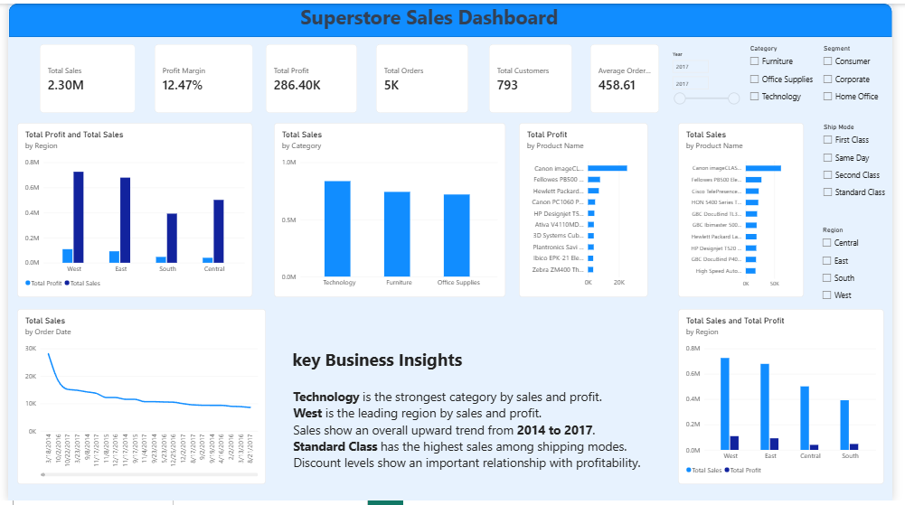
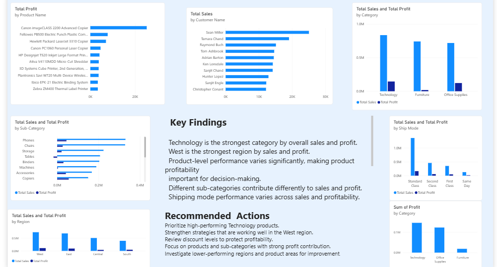

# FUTURE_DS_01 — Business Sales Performance Analytics

## Future Interns — Data Science & Analytics

### Project Overview

This project analyzes business sales data to identify revenue trends, top-performing products, high-value categories and regions, and opportunities for business growth.

The analysis was performed using Python for data cleaning and exploratory data analysis, and Power BI for interactive dashboard development.

## Objectives

- Identify products generating the most revenue.
- Analyze sales trends over time.
- Identify high-value categories and regions.
- Understand product and regional profitability.
- Provide actionable recommendations for business growth.

## Tools & Technologies

- Python
- Pandas
- Matplotlib
- Seaborn
- Jupyter Notebook
- Power BI
- DAX
- Power Query
- GitHub

## Dataset

Dataset used: Sample Superstore

The dataset contains business sales information including:

- Orders
- Customers
- Products
- Categories
- Sub-Categories
- Sales
- Profit
- Quantity
- Discount
- Regions
- Shipping Modes

## Data Preparation

The dataset was cleaned and prepared using Python.

Steps included:

- Loaded the raw CSV dataset.
- Converted Order Date and Ship Date to datetime.
- Converted Postal Code to text.
- Checked missing values.
- Checked duplicate records.
- Created Year, Month, Quarter and Profit Margin features.
- Validated the cleaned dataset.

## Exploratory Data Analysis

The analysis examined:

- Overall sales and profit performance.
- Monthly and yearly sales trends.
- Category performance.
- Regional performance.
- Sub-category performance.
- Customer performance.
- Shipping mode performance.
- Discount and profitability relationship.

## Power BI Dashboard

### Page 1 — Executive Sales Overview

The dashboard contains:

- Total Sales
- Total Profit
- Total Orders
- Total Customers
- Profit Margin
- Average Order Value
- Sales Trend
- Sales by Category
- Sales & Profit by Region
- Top 10 Products by Sales
- Interactive filters

### Page 2 — Product & Regional Performance

The dashboard contains:

- Top 10 Products by Profit
- Sub-Category Performance
- Top 10 Customers by Sales
- Category Sales vs Profit
- Regional Performance
- Profit Margin by Category
- Ship Mode Performance
- Key Findings
- Recommended Actions

## Key Business Insights

- Technology is the strongest category by overall sales and profit.
- The West region leads in both sales and profit performance.
- Sales show an overall upward trend from 2014 to 2017.
- Standard Class is the highest-performing shipping mode by sales and profit.
- Discount levels show an important relationship with profitability.

## Recommendations

1. Prioritize high-performing Technology products and maintain strong inventory availability.
2. Study successful strategies used in the West region and apply relevant practices to other regions.
3. Review discount levels to improve profitability and avoid unnecessary margin reduction.
4. Focus on products and sub-categories with strong profit contribution.
5. Investigate lower-performing regions and product areas for improvement.

## Project Structure

```text
FUTURE_DS_01/
│
├── README.md
├── data/
├── notebooks/
├── dashboard/
└── insights/BI

## Dashboard Preview

### Executive Sales Overview


### Product & Regional Performance

